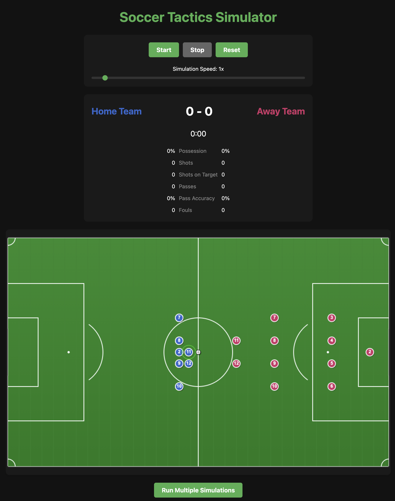

# Soccer Tactics Simulator

A web-based soccer tactics simulator for testing formations and strategies through automated play at scale.

## Project Overview

This simulator allows users to:
- Test different soccer formations through automated simulation
- Compare statistical outcomes of tactical approaches
- Create and modify custom formations with drag-and-drop interface
- Analyze match data through heatmaps, pass networks, and statistical charts
- Save and replay simulations

## Features

- Physics-based ball and player movement
- AI-driven player decision making
- Support for standard and custom formations
- Player attribute system based on EA Sports ranking model
- Comprehensive match statistics and analysis tools
- Variable team sizes for drills and card simulations
- Local database for storing and retrieving match data

## Current Status

Basic project structure, core models, services (Simulation, Database), and UI components (`SimulationPage`, `MatchVisualizer`, `MatchControls`) are in place. Dependencies are installed, and the basic UI renders.

**Significant Missing Features for Core Functionality:**

1.  **Realistic Physics:** Ball movement needs implementation.
2.  **Core Gameplay Logic:** Collision detection, possession changes, goal detection.
3.  **Basic AI:** Players need logic to decide where to move.

## Next Steps (Refined Plan)

To achieve a basic, visually active simulation:

1.  **Implement Ball Physics:** In `src/models/Ball.ts`, add movement based on `velocity` and apply friction in `update()`.
2.  **Implement Player-Ball Collision:** In `Match.update()`, check for collisions between players and the ball.
3.  **Implement Possession Logic:** In `Match.updatePossession()`, assign `Player.hasBall` based on collision/proximity and potentially link `Ball.position` to the controlling player.
4.  **Basic Player AI (Ball Chasing):** In `Player.update()`, set `targetPosition` towards the `ball.position` if the player doesn't have the ball.
5.  **Goal Detection:** In `Match.update()`, check if the ball crosses the goal line boundaries. If so, trigger a `GOAL` event, update stats, and reset positions.
6.  **Assign Team Colors:** Ensure `Team` instances in `SimulationService.createQuickMatch` have distinct colors passed to `Player` constructors.

## Getting Started

See the development plan document for more details on the implementation.

## Project Structure

```
soccer-sim/
├── src/
│   ├── components/    # React components
│   ├── models/        # Data models (Player, Ball, etc.)
│   ├── services/      # Services (Simulation, Database)
│   └── utils/         # Utility functions
├── public/            # Static assets
├── index.html         # Main HTML entry point
├── package.json       # Dependencies and scripts
├── SoccerSimPlan.md   # Planning document
└── todoDev.md         # Detailed development todo list
```

## Future Plans

We aim to implement a complete soccer tactics simulator with support for:

- Custom formations editor
- Advanced player AI
- Comprehensive statistics and visualization
- Web-based deployment for sharing
- Multi-match simulation for tactical research

## License

This project is licensed under the MIT License. 
## Preview

<p align="center">
  
</p>

